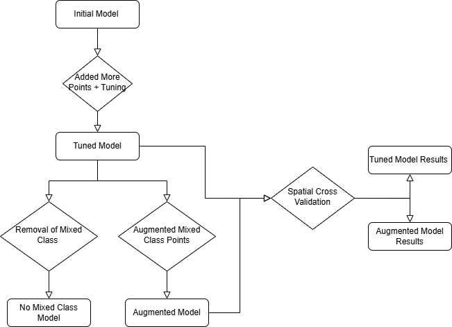

# 🌳 Tree Species Mapping with Random Forest

This project implements a **Random Forest** machine learning pipeline to map tree species using spatial data. It addresses real-world challenges such as **class imbalance**, **spatial validation**, and **data augmentation**. The workflow is inspired by ecological data science use cases and integrates various data processing and model evaluation techniques.

---

## 📌 Objective

To develop a robust spatial classification model that accurately predicts tree species classes, especially when dealing with mixed and imbalanced data.

---

## 📊 Workflow Summary

1. **Initial Model**  
   Trained using raw data.

2. **Added More Points + Tuning**  
   Additional data points and hyperparameter tuning improved performance.

3. **Tuned Model**  
   The model trained with updated and tuned parameters.

4. **Class Imbalance Management**  
   - 🔍 **Option 1: Removal of Mixed Class Points**  
     Created a `No Mixed Class Model` for purer classification.
   - 🔁 **Option 2: Augmented Mixed Class Points**  
     Generated synthetic or extrapolated samples to boost underrepresented classes, resulting in the `Augmented Model`.

5. **Spatial Cross Validation**  
   Ensured that model generalization is tested across spatially distinct folds.
---

## 📉 Handling Class Imbalance

Imbalanced classes (e.g., rare tree species) are a common issue in ecological datasets. This project addresses imbalance through two key strategies:

- **Class Removal**: Excludes ambiguous "mixed" samples to focus the model on clearer signals.
- **Data Augmentation**: Boosts rare class representation by duplicating or synthetically generating additional samples using spatial interpolation or SMOTE-like techniques.

Each method's performance is compared using **spatial cross-validation** to ensure ecological validity and prevent overfitting to clustered data.

---

